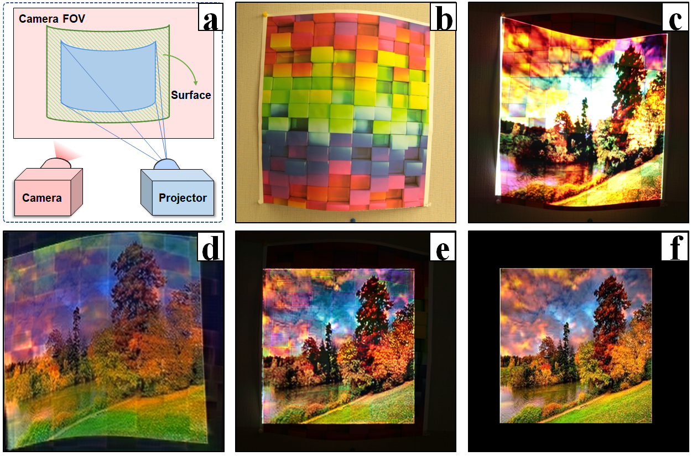
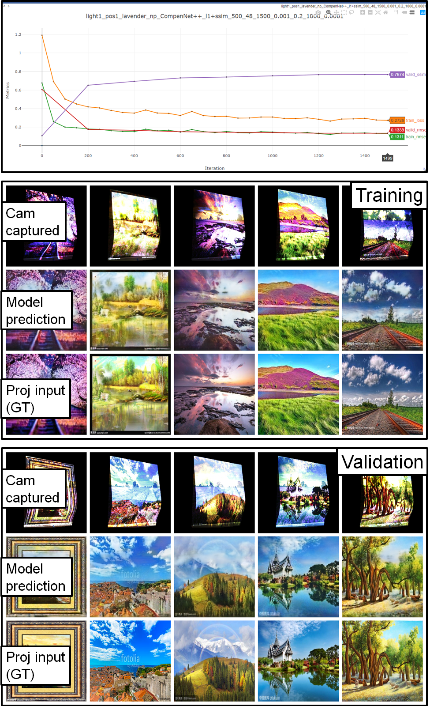
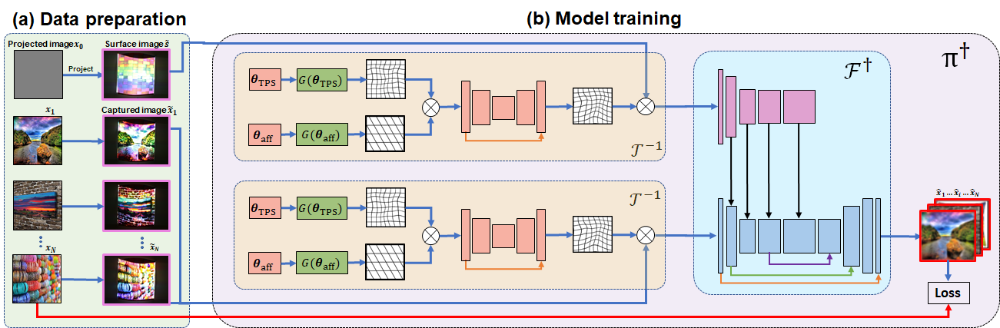
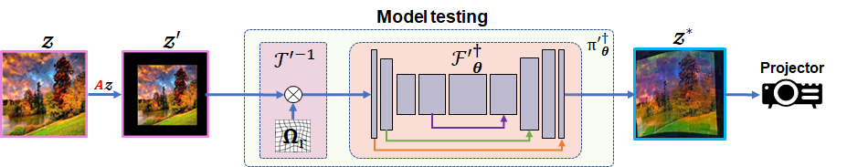

  

CompenNet++: End-to-end Full Projector Compensation (ICCV'19)
  
===

## Introduction
PyTorch implementation of [CompenNet++][1]. Also see [journal version][7].

Highlights:
*  The proposed **CompenNet++** is the **first end-to-end full** projector compensation system.
*  Compared with two-step methods (e.g., [CompenNet][5] w/ SL), CompenNet++ learns the geometric correction **without** extra sampling images (~42 images) and outperforms the compared counterparts.
*  Two task-specific weight initialization approaches are proposed to ensure the convergence and stability of CompenNet++.
*  Novel simplification techniques are developed to improve the running time efficiency of CompenNet++.

For more info please refer to our ICCV'19 [paper][1], high-res [supplementary material ~(180M)][2] and CompenNet++ [benchmark dataset (~11G)][3]. 

## Prerequisites
* PyTorch compatible GPU
* Python 3
* PyTorch == 0.4.0
* opencv-python >= 3.4.4 (since 3.4.4 is no longer suported by pip, you may use 4.x instead)
* visdom (for visualization)

## Usage
### 

1. Clone this repo:
   
        git clone https://github.com/BingyaoHuang/CompenNet-plusplus
        cd CompenNet-plusplus

2. Install required packages by typing
   
        pip install -r requirements.txt
    

3. Download CompenNet++ [benchmark dataset (~11G)][3] and extract to [`data/`](data)

4. Start **visdom** by typing

        visdom

5. Once visdom is successfully started, visit [`http://localhost:8097`](http://localhost:8097) (train locally) or `http://serverhost:8097` (train remotely).
6. Open [`main.py`](src/python/main.py) and set which GPUs to use. An example is shown below, we use GPU 0, 2 and 3 to train the model.
   
        os.environ['CUDA_VISIBLE_DEVICES'] = '0, 2, 3'
        device_ids = [0, 1, 2]

7. Run [`main.py`](src/python/main.py) to start training and testing

        cd src/python
        python main.py
8. The training and validation results are updated in the browser during training. An example is shown below, where the 1st figure shows the training and validation loss, rmse and ssim curves. The 2nd and 3rd montage figures are the training and validation pictures, respectively. In each montage figure, the **1st rows are the camera captured uncompensated images, the 2nd rows are CompenNet++ predicted projector input images and the 3rd rows are ground truth of projector input images**. 
9. The quantitative comparison results will be saved to `log/%Y-%m-%d_%H_%M_%S.txt` after training.
   

----
## Apply CompenNet++ to your own setup

1. For a nonplanar textured projection surface, adjust the camera-projector such that the brightest projected input image (plain white `data/ref/img_0125.png`) slightly overexposes the camera captured image. Similarly, the darkest projected input image (plain black `data/ref/img_0001.png`) slightly underexposes the camera captured image. This allows the projector dynamic range to cover the full camera dynamic range. 
2. Once the setup is fixed, we create a setup data directory `data/light[n]/pos[m]/[surface]` (we refer it to `data_root`), where `[n]` and `[m]` are lighting and pose setup indices, respectively. `[surface]` is the projection surface's texture name.
3. Project and capture the plain black `data/ref/img_0001.png` and the plain white images `data/ref/img_0125.png` for projector FOV mask detection later. Then, save the captured images to `data_root/cam/raw/ref/img_0001.png(img_0125.png)`.
4. Project and capture a surface image `data/ref/img_gray.png`. Then, save the captured images to `data_root/cam/raw/ref/img_0126.png`.
5. Project and capture the training and validation images in `data/train` and `/data/test`. Then, save the captured images to  `data_root/cam/raw/train`,  `data_root/cam/raw/test`, respectively.
6. Find the optimal displayable area following the algorithm in `loadData` in [trainNetwork.py](src/python/trainNetwork.py). Then, affine transform the images in `data/test` to the optimal displayable area and save transformed images to `data_root/cam/raw/desire/test`. Refer to model testing below.
   
Note other than `ref/img_0001.png`, `ref/img_0125.png` and `ref/img_gray.png`, the rest plain color  images are used by original TPS w/ SL method, we don't need them to train CompenNet++. Similarly, `data_root/cam/raw/sl` and `data_root/cam/warpSL` are only used by two-step methods.

----
## Network architecture (training)

## Network architecture (testing)

----
## Citation
    @inproceedings{huang2019compennet++,
        author = {Huang, Bingyao and Ling, Haibin},
        title = {CompenNet++: End-to-end Full Projector Compensation},
        booktitle = {IEEE International Conference on Computer Vision (ICCV)},
        month = {October},
        year = {2019} }

    @inproceedings{huang2019compennet,
        author = {Huang, Bingyao and Ling, Haibin},
        title = {End-To-End Projector Photometric Compensation},
        booktitle = {IEEE Conference on Computer Vision and Pattern Recognition (CVPR)},
        month = {June},
        year = {2019} }

## Acknowledgments
The PyTorch implementation of SSIM loss is modified from [Po-Hsun-Su/pytorch-ssim](https://github.com/Po-Hsun-Su/pytorch-ssim).
The PyTorch implementation of TPS warping is modified from [cheind/py-thin-plate-spline](https://github.com/cheind/py-thin-plate-spline).
We thank the anonymous reviewers for valuable and inspiring comments and suggestions.
We thank the authors of the colorful textured sampling images. 

## License
This software is freely available for non-profit non-commercial use, and may be redistributed under the conditions in [license](LICENSE).

[1]: https://bingyaohuang.github.io/pub/CompenNet++
[2]: https://bingyaohuang.github.io/pub/CompenNet++/supp
[3]: https://bingyaohuang.github.io/pub/CompenNeSt++/full_cmp_data
[4]: https://www.mathworks.com/help/vision/ref/detectcheckerboardpoints.html
[5]: https://github.com/BingyaoHuang/CompenNet
[6]: https://github.com/BingyaoHuang/single-shot-pro-cam-calib/tree/ismar18
[7]: https://github.com/BingyaoHuang/CompenNeSt-plusplus
